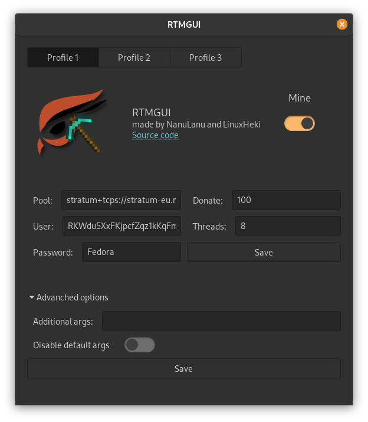

# RTMGUI

RTMGUI is free and open-source crypto miner for Linux. It uses [cpuminer-gr-avx2](https://github.com/WyvernTKC/cpuminer-gr-avx2) for mining and GTK3 for GUI.

 
 

## Usage

Command line options:
* `start` for start mining
* `stop` for stop mining
* `--close` for close window
* `--open` for open window
 
 

## Build from source

If you want to build RTMGUI from source, you'll need to have:
* python3
* gtk3
* pyinstaller
* pygobject
* gir1.2-appindicator3-0.1
 
 

Build:

`make && sudo make install`

or if you want deb package:

`make && make deb`
 
 

## Custom cpuminer-gr-avx2

If you want to use custom version of cpuminer-gr-avx2 you need to replace `cpuminer` with the new one and than reinstall RTMGUI or replace `/opt/rtmgui/cpuminer` and restart the app.
 
 

## Donate

If you want to support me, please mine for some hours with my wallet and don't forget to set custom password ; ). Thank you!
 
Monero address: `45xutTV4zsmBWTiEwxjt5z2XpPyKMf4iRc2WmWiRcf4DVHgSsCyCyUMWTvBSZjCTwP9678xG6Re9dUKhBScPmqKN6DUXaHF`

Raptoreum address: `RWMf4o2nj7MtVRUtPnJB5FJ7fumHPeENFb` or `RKWdu5XxFKjpcfZqz1kKqFmaF7JRsecM5y`